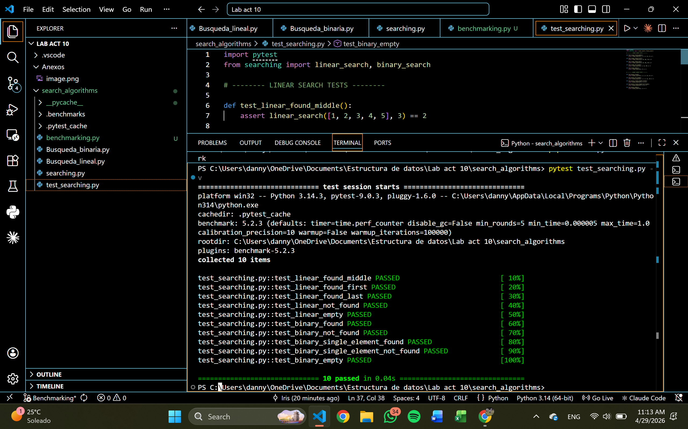
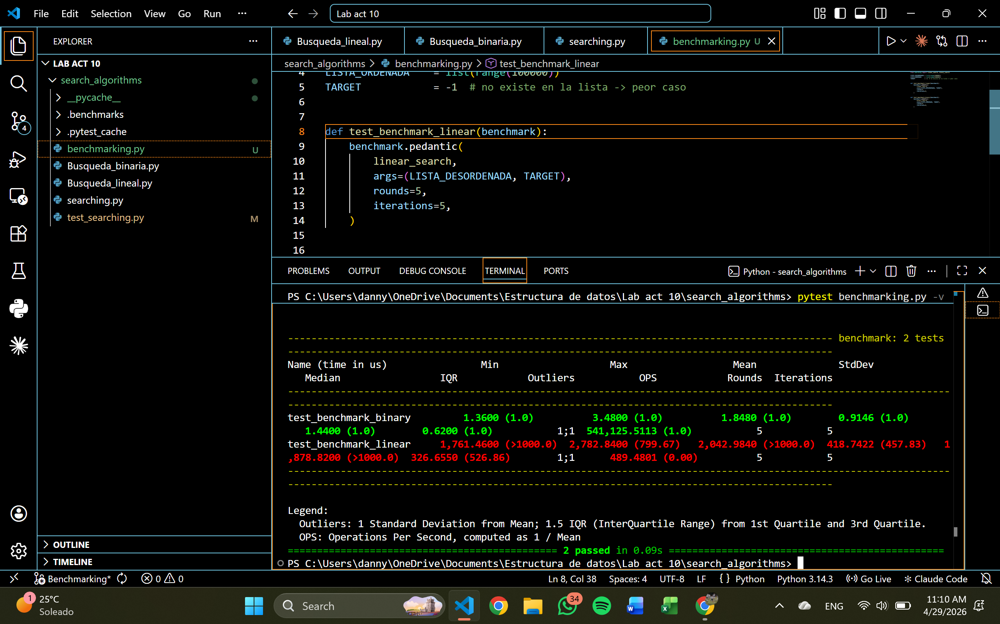

# Search Algorithms

Repositorio con implementaciones de búsqueda lineal y búsqueda binaria, junto con pruebas unitarias automatizadas y benchmarking.

---

> ###  Inicio rápido (sin entorno virtual)
> Clona, instala dependencias y corre los tests en un solo comando:
> ```bash
> git clone git@github.com:irispilo/search_algorithms.git && cd search_algorithms && pip install pytest pytest-benchmark && pytest test_searching.py -v
> ```

---

## Clonar el repositorio

```bash
git clone git@github.com:irispilo/search_algorithms.git
cd search_algorithms
```

---

## Preparar el entorno

Se recomienda usar un entorno virtual de Python:

```bash
python -m venv .venv
```

Activar el entorno virtual:

- **Windows:**
  ```bash
  .venv\Scripts\activate
  ```
- **macOS / Linux:**
  ```bash
  source .venv/bin/activate
  ```

Instalar dependencias:

```bash
python -m pip install --upgrade pip
pip install pytest pytest-benchmark
```

---

## Ejecutar el unit testing

Las pruebas unitarias se encuentran en [`test_searching.py`](test_searching.py) y cubren los algoritmos `linear_search` y `binary_search` con al menos 5 escenarios cada uno.

Ejecutar todas las pruebas:

```bash
pytest test_searching.py -v
```

---

## Ejecutar el benchmarking

El benchmarking se encuentra en [`benchmarking.py`](benchmarking.py) y utiliza `pytest-benchmark` en modo `pedantic` con 5 rounds de 5 iteraciones cada uno, evaluando el peor caso (target no encontrado) en una lista de 100,000 elementos.

```bash
pytest benchmarking.py -v
```

---

## Anexos

### Unit Testing — Resultados



### Benchmarking — Resultados


